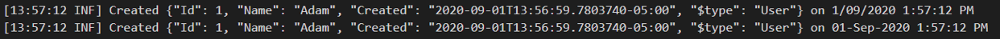
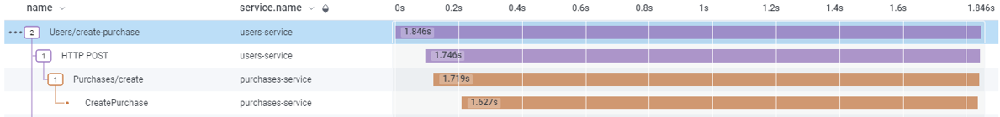
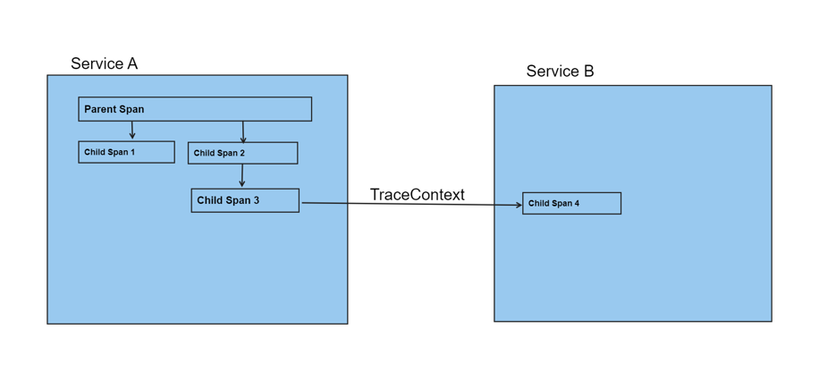

# OpenTelemetry: More than just a different way to log

with AL Rodriguez

---

# Me (AL)

- @ProgrammerAL
- ProgrammerAL.com
- Senior Azure Cloud Engineer at Microsoft

---

# 1957
- Fortran programming language created
- Plain text log messages go to console/text files

---

# 2024+
- More programming languages exist
- Plain text log messages to console/files/3rd party company solution
- Logs have higher verbosity, more data per line
  - Timestamp, log level, JSON output, Thread Id, Request Id, etc

---

# Limitations of Plain Text Logs

- Data in files is hard to sift through
  - And expensive
- Hard to combine logs for a distributed application
- Custom providers can make this way easier
  - Take a big dependency on the vendor
- Example Scenario:
  - UI calls `Service A` which calls `Service B` which calls `Service C`
	- An exception occurs in `Service B` because of response from `Service C`
	- How do you debug that?

---

# What is Observability?

"Observability is about getting the right information at the right time into the hands of the people who have the ability and responsibility to do the right thing. Helping them make better technical and business decisions driven by real data, not guesses, or hunches, or shots in the dark. Time is the most precious resource you have — your own time, your engineering team’s time, your company’s time." - Charity Majors (@mipsytipsy) CTO of Honeycomb

---

# Why Observability?

- To diagnose productions issues
- To query for business metrics

---

# Azure Application Insights SDK

- Upload Logs
- Upload Metrics
  - Usage patterns, trends, requests per second, etc
- Track Transactions
  - HTTP Requests
  - Custom Events (wrap methods, external dependency calls, etc)

---

# OpenTelemetry (OTel)

"OpenTelemetry is a collection of APIs, SDKs, and tools. Use it to instrument, generate, collect, and export telemetry data (metrics, logs, and traces) to help you analyze your software’s performance and behavior." - OpenTelemetry.io

---

# OpenTelemetry (OTel)

- Open standard for collecting telemetry data about distributed services
- Open Source, Vendor Neutral, Language Agnostic
- APIs
- https://OpenTelemetry.io

---

# What kind of data does OTel collect?

- Traces
  - Requests in the system
- Metrics
  - Numbers
    - Performance counters/requests per second/etc

---

# OTel Metrics

- Counters
- CPU/Memory usage on the box
- Requests per second

---

# OTel Traces

- Info for a request
- Full lifetime of the request

---

# OTel Trace

---

# Trace Spans

- Traces made up of child Spans
- Spans have child attributes
  - Key/Value pairs of custom data

---

# Trace Example

- Trace is created when a request comes into the system
- A span is made to wrap around call to database
	- Span attributes for the database call like query, runtime, cost
- Another span is created when making call out to 3rd party service
	- Span stores time it took to run the HTTP request and the response HTTP status code, plus error if needed

---

# TraceContext

- Unique Id of the Trace
- Libraries usually add/parse automatically
  - Can add custom code to add/parse it
- 00-c9dafef5b02172ce9f19a70ee83e9fc8-4f78ce7bf9cb7d22-01
  - Separated by dashes:
		- Version Format
		- Trace Id
		- Parent Id
		- Trace Flags

---

# TraceContext Visual

---

# Demo Time

---

# OTel Logs

- For Backwards Compatibility
- Each message added as a Span

---

# OTel in the UI

- Possible
- Still a Work in Progress

---

# Online Info

- @ProgrammerAL
- programmerAL.com

