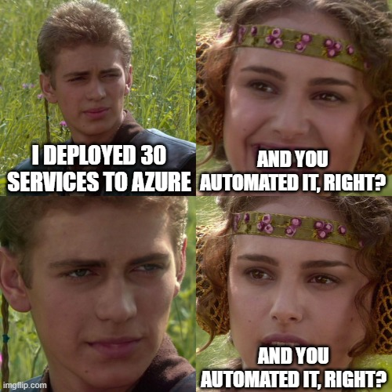

# Beginner's Guide to Pulumi: Infrastructure as Code with Code

with AL Rodriguez


---

# Me (AL)

- @ProgrammerAL
- programmerAL.com
- NOT affiliated with Pulumi


---

# What this session is

- Outline of Infrastructure as Code (IaC)
- Introduction to Pulumi
- Demo with C# and Azure
  - Concepts apply to other languages/clouds supported by Pulumi

---



---

# Infrastructure as Code (IaC)

- Automation to avoid manual steps
  - Manual steps always mess up eventually
- Easily repeatable
  - Create multiple environments with ease

---

# What is Pulumi?

- Tooling for Cloud IaC
  - Create/Read/Update/Delete services
  - DSC - Desired State Configuration
- Use your choice or programming language
  - No YAML
  - No custom DSL
- Code is Open Sourced
  - _Can_ be free if you self host
- Procedural and Imperative

---

# What else is Pulumi?

- Written in your choice of language
- Cloud Specific

---

# C# Example Code

```csharp
using System.Threading.Tasks;
using Pulumi;
using Pulumi.Aws.S3;

await Deployment.RunAsync(() =>
{
    // Create an AWS resource (S3 Bucket)
    var bucket = new Bucket("my-bucket");

    // Export the name of the bucket
    return new Dictionary<string, object>
    {
        { "bucketName", bucket.Id },
    };
});
```

---

# What Pulumi isn't

- NOT a Cross-Platform abstraction
  - Clouds are target specifically
  - Ex: Cloud storage different between AWS S3 and Azure Blob Storage

---

# Programming Languages Supported

- Many programming languages supported and being added
  

---

# Cloud Providers Supported

- All the big ones
  - AWS, Azure, GCP, etc
- Other big but lesser known ones
  - DigitalOcean, Fastly, Scaleway, etc
- Utility SaaS Providers
  - Auth0, RedisCloud, DNSimple, GitHub, etc
- View all at: [pulumi.com/registry](https://www.pulumi.com/registry)
  - 1st party and 3rd party

---

# Demo 1 Time!

- Code
- Pulumi CLI
- Web Portal

---

#


---

# Input and Output Objects

- Object for a resource to be created
- Inputs
  - Become Outputs
- Outputs
  - Will have a value eventually...in the future
    - Ex: GUID id of a storage account
  - Used to modify a dependency in code

---

# Config

- YAML Files
- Per Stack
- Individual Key-Value pairs
  - Or objects

---

# Config Secrets

- Encrypted in config
- Per Stack
- Loaded as an Output value
- Plan-Text viewable via Pulumi CLI
  - When signed in

---

# Stack Outputs

- Set by You, your code
- Usable in:
  - Stack References
  - `Pulumi.README.md` files

---

# Pulumi A.I.

- Generate Pulumi Code using that thing everyone's talking about
- https://www.pulumi.com/ai

---

# Demo 2 Time!

- Pulumi Code
- Demo App


---

# Online Info

- @ProgrammerAL
- programmerAL.com


