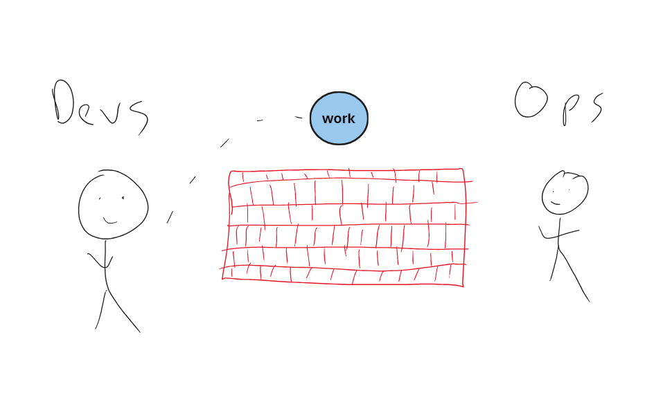
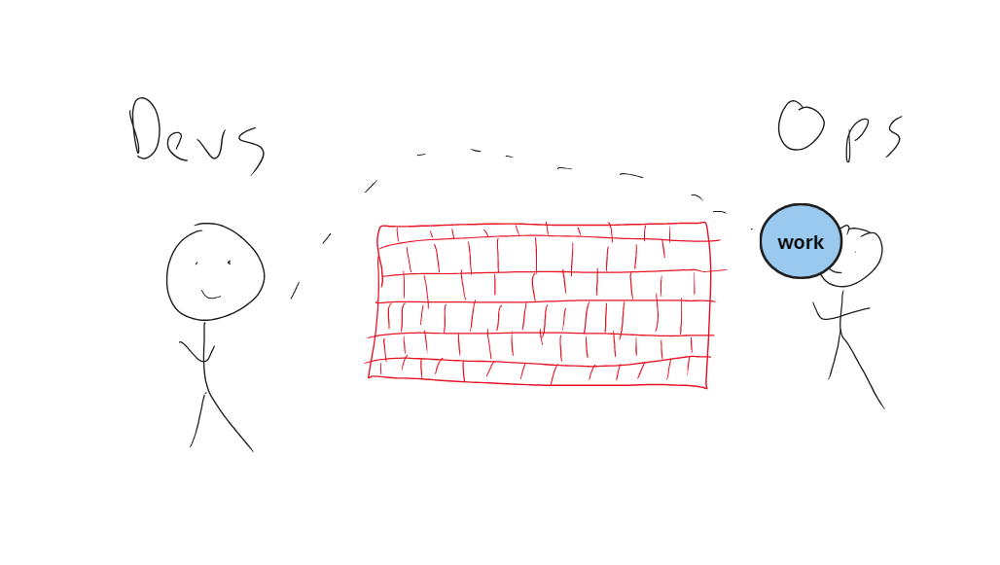
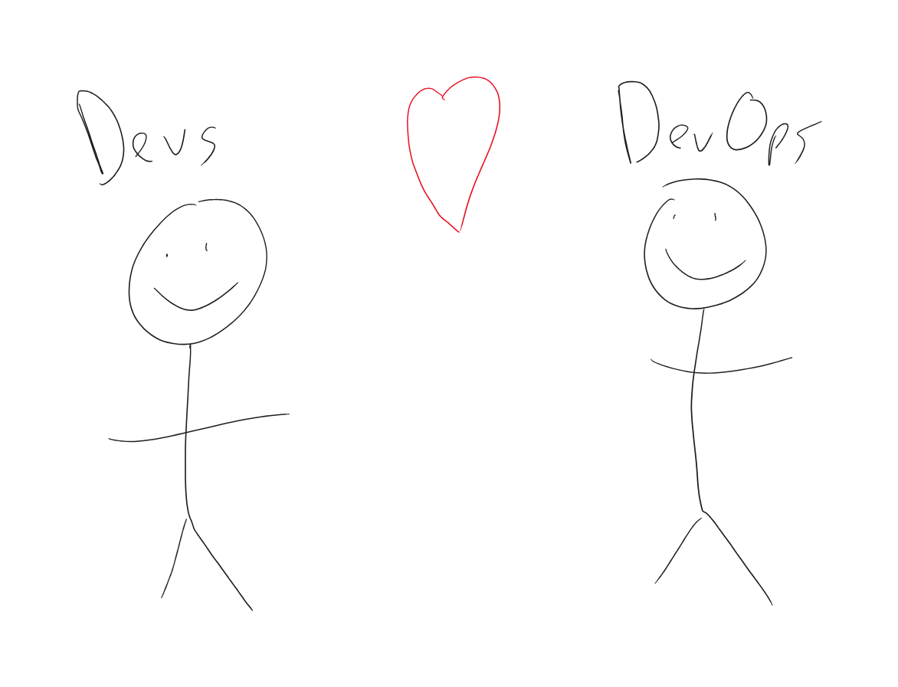
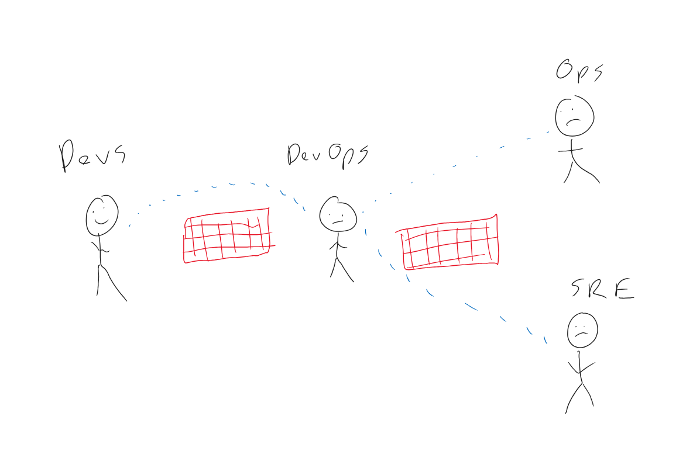

# Entire Stack C#

with AL Rodriguez

---

---

# Me (AL)

- @ProgrammerAL
- ProgrammerAL.com
- Senior Customer Experience Engineer (Azure ACE) at Microsoft

---

---

---

---

---

# We're Developers

- We write code
- We solve problems
- We automate things

---

# As Developers We Are...

- Opinionated about tooling
- Opinionated about how we solve problems
- Opinionated

---

# What's the "Entire Stack"?

- Frontend / Backend
- Build
- Deploy
- Automated Tests
- Doing all development in the same set of tools
  - The Best Tools - C# FTW!

---

# Why C# for the Entire Stack?

- ".NET Everywhere"
  - Scott Hanselman talked about it in 2021
  - https://www.youtube.com/watch?v=ZM6OO2lkxA4

---

# Define "Everywhere"

- **Frontend** - Blazor (Server and WASM) / Razor / MAUI / Desktop (WinForms, WPF, Avalonia, Uno Platform)
- **Backend** - ASP.NET, Console, Serverless
- **Testing** - Unit/Integration/Performance
- **CI/CD** - Cake, Nuke Build
- **IaC** - Pulumi, Aspire*
- **IoT** -  Meadow, GHI Electronics TinyCLR, .NET nanoFramework, Raspberry Pi
- **Video Games** -  Unity, Godot

---

# What do we get from Entire Stack C#?

- Tools Familiarity
- Local debugging and testing
- Developer Performance

---

# What are we going to do?

- Build and Deploy a Full Stack app
- Deploy Create Cloud Infrastructure
- Run UI Tests
- All with C# FTW!

---

# Full Stack App

- Blazor WASM
- Azure Functions

---

# CI/CD Pipelines

- Built with a Domain Specific Language
  - Usually YAML

---

# Run Code from YAML

- Call external CLI tool from YAML
  - AKA `dotnet run ...`

---

# SDKs for CI/CD Apps

- Cake
  - AKA C# Make
  - https://CakeBuild.net 
- Nuke
  - https://Nuke.build
- Fully Open Source
  - Free to use

---

# Script or Traditional App

- Custom C# Script
  - Requires extension for code editor
- Full App like a traditional app
  - Use your normal tools

---

# Cake

- Cake Frosting
  - Traditional App Style

---

# IaC

- Infrastructure as Code
- Create/Read/Update/Delete Cloud Infrastructure

---

# Pulumi

- IaC with your choice of programming language*
  - C# FTW!
- 3rd Party tool
  - Has own pricing, generaous free tier
- API very similar to cloud specific API

---

# UI Testing

- Simulate a real user
  - Verify UI reactions
- A type of Integration testing

---

# Playwright

- Web UI Testing
- Better than Selenium (opinion)
- Use your choice of programming language*
  - C# FTW!

---

# Demo Time

- Full Stack App
- GitHub Action - Build
  - Cake
- GitHub Action - Deploy
  - Cake
  - Pulumi
- GitHub Action
  - Selenium UI Tests

---

# Review

- Use platform-specific stuff to do platform-specific stuff

---

# Online Info

- @ProgrammerAL
- programmerAL.com

