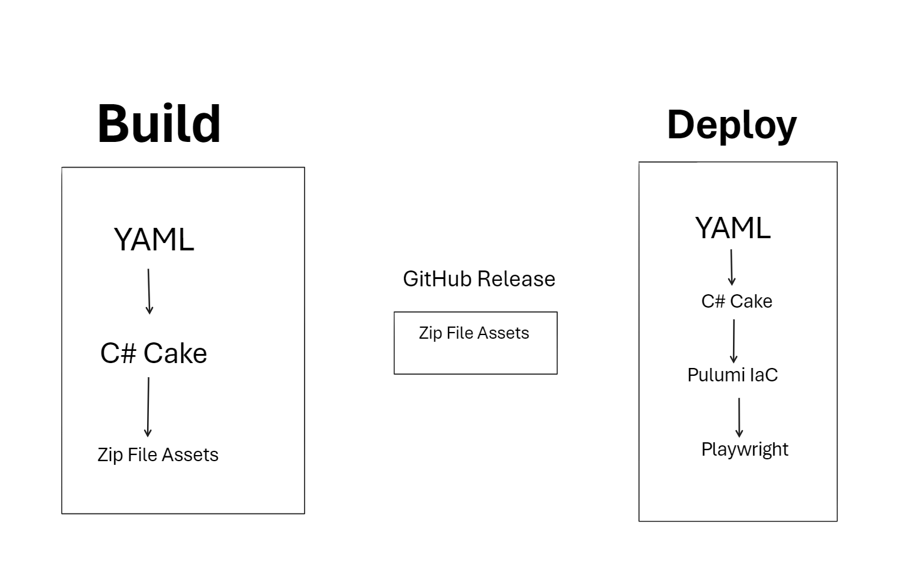

# Entire Stack C# (FTW!)

with AL Rodriguez


---

# Me (AL)

- @ProgrammerAL
- ProgrammerAL.com
- Developer, Developer, Developer


---


---


---


---


---

# .NET is Everywhere

- ".NET Everywhere"
  - Scott Hanselman talked about it in 2021
  - https://www.youtube.com/watch?v=ZM6OO2lkxA4

---

# Define "Everywhere"

- **Frontend** - Blazor (Server and WASM) / Razor / MAUI / Desktop (WinForms, WPF, Avalonia, Uno Platform)
- **Backend** - ASP.NET, Console, Serverless
- **Testing** - Unit/Integration/UI/Performance
- **CI/CD** - Cake, Nuke Build
- **IaC** - Pulumi, Aspire*
- **Video Games** -  Unity, Godot
- **IoT** -  Meadow, GHI Electronics TinyCLR, .NET nanoFramework, Raspberry Pi

---

# Why the Entire Stack with C#?

- Tools Familiarity
- Local debugging and testing
- Developer Performance
- C# FTW!

---

# What are we going to do?

- Build and Deploy a Full Stack app
- Create Cloud Infrastructure
- Run UI Tests
- All with C# FTW!

---



---

# Full Stack App

- Frontend
  - Blazor WASM
- Backend
  - Azure Functions

---

# CI/CD Pipelines

- Built with a Domain Specific Language
  - Usually YAML

---

# Run C# from YAML

- Call external CLI tool from YAML
  - AKA `dotnet run ...`

```YAML
- name: Cake Frosting Build in C# FTW
  run: dotnet run --project /build/build/Build.csproj -- --buildConfiguration=Release
```

---

# C# SDKs for CI/CD Apps

- Cake
  - AKA C# Make
  - https://CakeBuild.net 
- Nuke Build
  - https://Nuke.build

---


---

# IaC

- Infrastructure as Code
- Create/Read/Update/Delete Cloud Infrastructure

---

# Pulumi

- IaC with your choice of programming language*
  - C# FTW!
- 3rd Party tool
  - Has own pricing, generaous free offering
- API very similar to cloud specific API

---

# .NET Aspire*

- We're not using it
- Not all resources supported (yet)
- Not recommended for deploying to production (yet)
  - Local dev loop only (for now)

---


---

# UI Testing

- Simulate/Verify real user interactions
- A type of Integration testing

---

# Playwright

- Open Source from Microsoft
- Use your choice of programming language*
  - C# FTW!

---


---

# Review

- Use platform-specific stuff for platform-specific stuff
  - Use C# for everything else
- Automate More
- Use C#...FTW!

---

# Online Info

- @ProgrammerAL
- programmerAL.com


